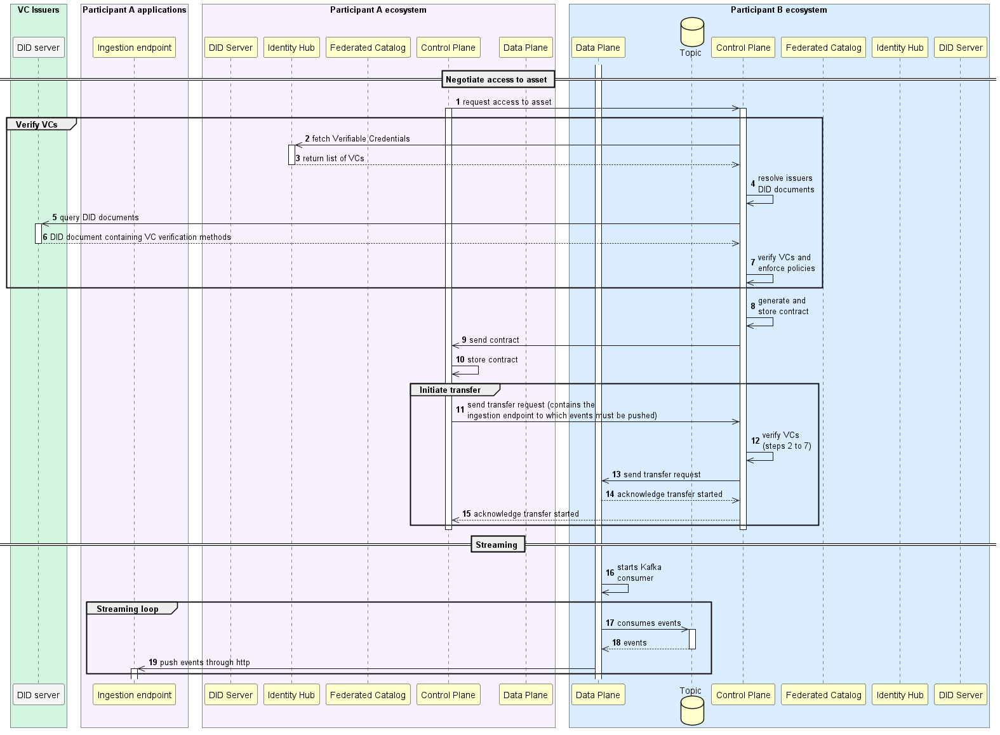
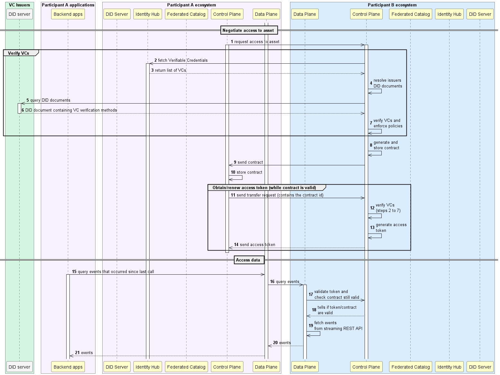
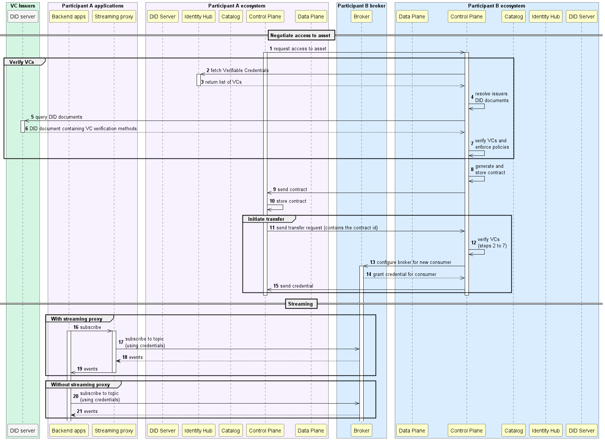
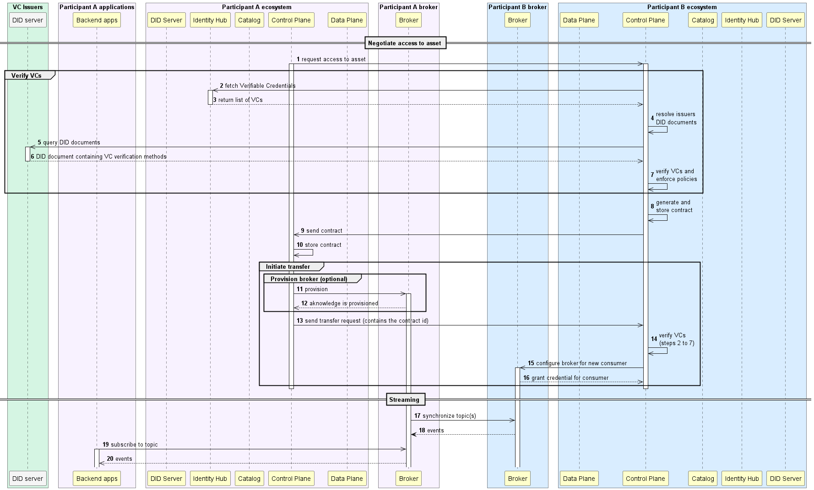
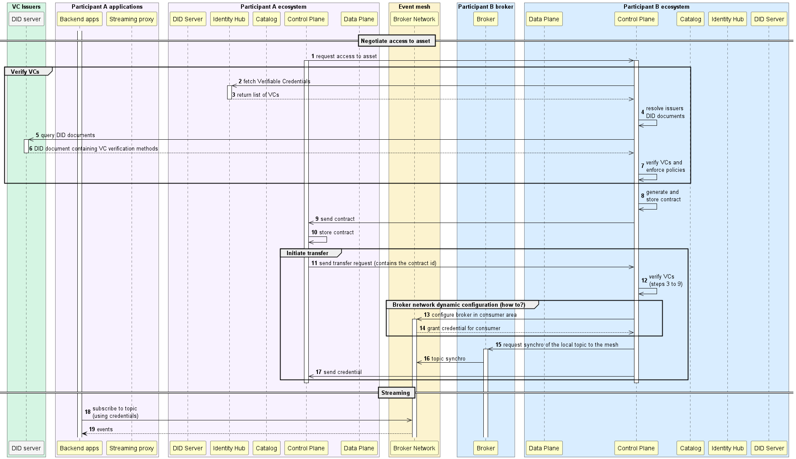

# Event streaming

## Current situation: provider push events through http

Today the EDC Connector repository provides a [Data Plane extension](https://github.com/eclipse-edc/Connector/tree/main/extensions/data-plane/data-plane-kafka) containing a Kafka implementation of `DataSource` and `DataSink`.

These implementations enable to consume and publish events from/to a Kafka topic, respectively. 

Thus, a simple approach to mimic a streaming pipeline could be to pair a `KafkaDataSource` that consumes from a topic on the provider side with a `HttpDataSink` that post them through 
http to an ingestion endpoint exposed by the consumer, as depicted below.

### Advantages

 - Very convenient for consumers that have minimal IT capacities as it does not require that they operate a broker. 

### Caveats

 - Drops most of the advantages of an event driven architecture (decoupling, asynchronicity, guarantee delivery, persistency...)
 - Poor performances (http calls will bottleneck the traffic)
 - Consumer sink must always be up
 - Provider must operator one (or even more) thread(s) per consumer that fetches the events from the source topic and publish to the consumer endpoint. 
    Thus, pressure increases with the number of consumers for the provider

## Towards an actual streaming architecture

The above approach suffers from major drawbacks, one essential being that it drops the inherent advantages of a streaming architecture (decoupling, asynchronicity, guarantee delivery, persistency...). 
Also it puts pressure on the provider infrastructure, which has to operate more and more threads as the number of consumers grows.

Hereafter we discuss alternative approaches that all rely on a real streaming architecture wherein the consumer directly subscribes to an event source exposed by the provider.

### Option 1: use a REST API on top of the streaming technology

This approach is the simplest to put in place as it relies on the [Consumer Pull](https://github.com/eclipse-edc/Connector/tree/main/extensions/control-plane/transfer/transfer-data-plane) concept already available in the EDC. It enables a consumer to actively pull the data from the provider. 

This approach requires a REST API that supports the streaming technology, which is the case for Kafka with the [Kafka REST API](https://github.com/confluentinc/kafka-rest).
This API is queried by the provider Data Plane at step (19).

#### Advantages

 - Simple to implement (EDC already supports consumer querying data through API)
 - Asynchronicity: the consumer doesn't need some always up service to receive data 
 - Slow consumes allowed
 - Replay is possible (might depend on the technology/available proxy)
 - No need for the consumer to operate a broker

#### Caveats

 - Performances due to usage of http (open a new connection for each polling request)
 - Different consumer to implement support various technology (as REST API from different technology will require different parameters)
 - Consumer to decide on polling frequency, two possible approaches:
   - Provider recommends a polling frequency based on the event rate on its topic (this can be a metadata of the dataset)
   - Possible to create a notification flow in which the provider signals to the consumer that new events are available for consumption → make the picture much more complex tough as it is not standard and requires to open access on both sides.

### Option 2: Use a standard streaming client

Here the consumer will use a streaming client (e.g. Kafka client) to subscribe to the event broker exposed by the provider. 
Two flavors are possible:
 - Consumer can use a streaming proxy (e.g. [Kafka Proxy](https://github.com/grepplabs/kafka-proxy)) that acts as central entry point for all its backend applications to consume events
 - Each consumer backend applications directly subscribes to the provider broker.

#### Advantages

 - Notification possible 
 - Improved performance compared to Option 1
 - Easier to implement from a consumer point of view as streaming features are built-in (sequencing, guaranteed delivery...)
 - Consumer does not need to operate a broker

#### Caveats

 - Security: exposing TCP ports (for Kafka) is much less standard that exposing http routes → Might be more complicated from a security perspective as there is nothing standard like a standard API gateway for events.
 - Kafka-specific: the above picture implies that the topology of the Kafka cluster is exposed externally, which might be a no-go from a security aspect → an alternative could be to expose the broker through a Kafka proxy.

### Option 3: Server-to-server synchronization

The final approach is to synchronize the consumer broker with the provider broker, which can be achieved by leveraging low level API such as Mirror Maker 2 for example.

#### Advantages

- Performances

#### Caveats

 - Exposition of TCP ports
 - Might mean strong coupling depending on the technology (Kafka: number of partitions, Kafka cluster versions might be incompatible...)
 - Complex/heavy/costly deployment on consumer side
 - Consumer must have a streaming client supporting the provider broker technology
 - Capability might be depending on the hosting cloud provider, e.g. provider is on Azure and expose an Azure Event Hub and consumer operates on AWS → might be complex for the consumer to deploy an Azure Event Hub on AWS.

## Cross-region optimization

Cross-region optimization comes into play when the number of consumers increases and those consumers are located within different geographic areas, e.g. if a provider located in EU has several consumers located in the US, it might be relevant to transfer the data once from EU to US, and then redispatch to the consumers in order to limit the network costs.

This is achieved by introducing a network of brokers (mesh) which are operated by the dataspace authority. Then, when a consumer subscribes to a topic exposed by a provider located in a different area, the provider initiates the replication of this topic on the mesh broker(s) located in the consumer region.

This approach is very complex tough, as it involves to be able to dynamically configure the mesh for synchronizing the provider broker topic with the mesh.