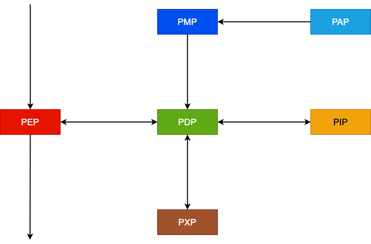
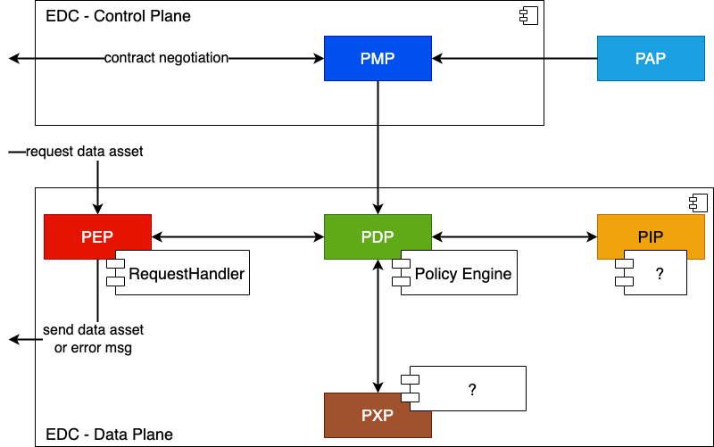

# Viewpoint Ecosystem

The EDC Usage Control regime is embedded into an ecosystem of other components, some inside the network of the operating company and some outside. Depending on their location and their provided Usage Control capabilities, different exchange paths must be followed. For instance, if an EDC is obliged to _DELETE_ a certain Data Asset after five days, a READ request from an application with own data persistence capabilities cannot be granted. If however this application exposes a respective PXP for the EDC Usage Control engine, or even accepts the deletion obligation explicitly, access can be enabled.

Similarly, if a company-external application requests the Data Asset, independently of a provided PXP or not, the request must be denied. To cover these cases, the EDC Usage Control engine therefore requires an understanding of:
- The own network location,
- which applications are part of that network and which not,
- and relevant endpoints for either providing input for a decision process (PIP, PDP, PAP) or execute a command (PXP).

## The Ecosystem from a Legal Perspective

The surrounding of the EDC usually represents the organizational landscape to some degree. Services located inside an organizational network usually

## The Ecosystem from a Business Perspective

todo

## The Ecosystem from a Communication Perspective

todo

*Basic interactions between the Policy Points.*

## The Ecosystem from a Contract Perspective

todo

## The Ecosystem from an Implementation Perspective

todo

*Policy Points in an EDC setup.*

## The Ecosystem from a Deployment and Operation Perspective

todo
