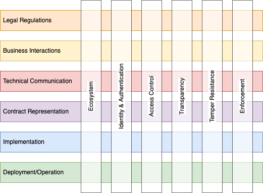

# Usage Control

## Content:

- [Overview & Viewpoints](./README.md)
- [Ecosystem](ecosystem.md) (TODO)
- [IAM](iam.md) (TODO)
- [Access Control](access_control.md) (TODO)
- [Transparency](transparency.md) (TODO)
- [Temper Resistance](temper_resistance.md) (TODO)
- [Enforcement](enforcement.md) (TODO)
- ...

## Overview

Usage Control is a concept to expand data protection from the provider system to the IT environment of the user. Similar to Security, Usage Control is never absolute but depends on the requirements and threads of each use case. Also similar to Security, Usage Control requires a comprehensive treatment as the overall control level is only as strong as its weakest aspect.

Due to the complexity of the topic and the huge amount of influencing factors, a matrix structure is outlined how to organise the various aspects, shown below. The respective aspects are grouped in _viewpoints_, each regarding a dedicated set of _concerns_, which have been introduced through identified _stakeholders_. The approach follows roughly the specifications of ISO/IEC 42010 and uses its terminology in the following.

*Matrix of horizontal and vertical viewpoints of Usage Control.*

Separating the concerns and simplifying the discussion, the interdependencies of the horizontal viewpoints are mostly limited to the direct neighbors. The vertical viewpoints affect all horizontal ones while in themselves do not provide a native hierarchy.  

## Business Viewpoint

### Roles: Organizations, Human and Technical Users

Contracts are negotiated in principle between legal entities. In the case of the EDC, that implies that organisations are the anchors of any ContractOffer or ContractAgreement, therefore, only organisations possess or grant usage rights. Nevertheless, policies need to provide the expressiveness to further restrict the potential users of an Asset. If for instance Company A grants its business partner Company B access to their production plan, Company A usually wants to prohibit that every employee of Company B can see it. Consequently, the ContractAgreement between Company A and Company B need a Constraint describing the allowed endusers.

The EDC fulfills this requirement by ... <!-- TODO: Explain the solution. -->
